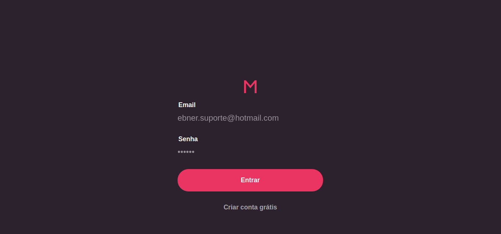

# Desafio RocketSeat - BackEnd em NodeJS

Esse é um guia básico de instalação do FrontEnd

1. Clone o repositório
2. No diretório da aplicação rode: yarn start
3. Processo finalizado

## Serviços disponíveis (Imagens)

### Tela de login

